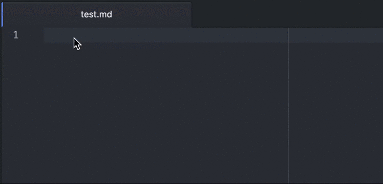
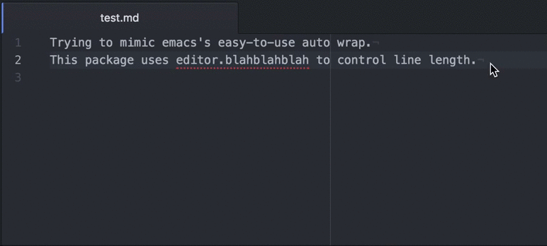

# Slickwrap

Trying to mimic emacs's easy-to-use auto wrap.
This package uses _editor.preferredLineLength_ from [wrap-guide](https://github.com/atom/wrap-guide) package to control line length. If wrap-guide package is not installed, _Max Row Length_ from the package setting is used (default to 80).

## Usage

### Auto Hard Wrap

If _Auto Hard Wrap_ is turned on in package settings, a hard wrap will be inserted to control row length, but keep row as long as possible. Typing whitespace characters (WS, TAB, ENTER) will trigger auto wrap when _Auto Hard Wrap_ is turned on.

### Wrap File

Use keymap _alt-q_ to wrap the whole file. This will make the file only contain lines within configured max row length.

### Note

In case you are wondering why the _Max Row Length_ setting is not working. This package uses the [wrap-guide](https://github.com/atom/wrap-guide)'s line length for better results.

For files doesn't contain extension, you can always wrap it with _alt-q_, but if you really want to auto wrap this type of files, add '' to the _Supported File Extensions_ settings. (for e.g.: before adding the old list is 'md, js', after adding empty empty extension, it becomes 'md, js, ')
